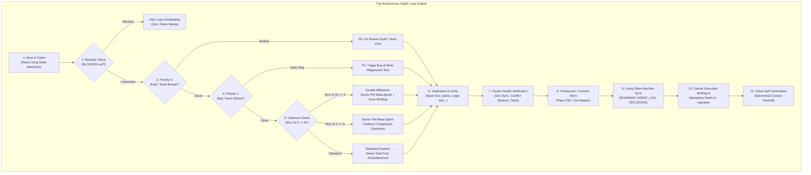

# Autoloop 🚀

> **Autonomous self-improving development harness and project bootstrapper powered by the Ralph loop.**

Autoloop is a scaffolding toolkit and operational lifecycle designed to bootstrap software projects that develop, test, and self-improve autonomously under AI direction—requiring **little executive oversight** and **near-zero code oversight**.

Whether you are spinning up an experimental project in **Google3 (Piper/CitC/Blaze)**, an open-source project on **GitHub**, or a standalone local prototype, Autoloop equips your workspace with an autonomous nervous system that prevents context rot, eliminates code debt, and enforces continuous verification.

---

## 1. Why Autoloop?

Most AI coding agents fail when applied to real-world projects over multiple days:
- **Context Rot**: As conversation history grows, LLMs hallucinate, forget initial constraints, and contradict earlier architectural choices.
- **Entropy & Debt Accumulation**: Agents write code to satisfy the immediate prompt, leaving test suites slower, mocks uninitialized, build targets monolithic, and linters noisy.
- **Ambiguity Paralysis**: Agents halt frequently to ask trivial questions, or silently hallucinate missing credentials when they get stuck.

Autoloop solves this by implementing **The Ralph Loop**—a stateless, self-regulating meta-system proven over 75+ continuous autonomous iterations:



---

## 2. The Core Tenets of the Ralph Loop

### I. Bounded Ephemeral Context Slices
Agents are ephemeral workers. An agent does not try to build an entire product in one conversation. Each iteration is scoped to **one atomic task** (typically 5–20 minutes). Memory is externalized in markdown state machines and VCS commits rather than in prompt context.

### II. Living Markdown State Machines
Project state is maintained in structured, machine-parseable text files:
- **`MANIFESTO.md`**: Project vision, core pillars, non-negotiable invariants, and architectural boundaries.
- **`ROADMAP.md`**: The single source of truth for backlog tasks (`[ ]`, `[IN PROGRESS]`, `[DONE]`) across structured phases.
- **`DECISIONS.md`**: Architectural Decision Records (ADRs). Prevents contradictory refactors or architecture flip-flopping across iterations.
- **`AGENT_LOG.md`**: Chronological run ledger with execution timestamps, verification results, and explicit handoff notes.
- **`IDEAS.md`**: Intake hopper for brainstormed concepts with mandatory letter grades (`Rank A+`, `A`, `B`).
- **`BLOCKED.md`**: Circuit breaker. If an external credential or dependency is missing, the agent records the blocker and halts immediately rather than hallucinating fake data.

### III. The Cadence Protocol (Senior PM Meta-Sprints)
Unsupervised agents accumulate technical debt. Autoloop prevents this with scheduled meta-improvement sprints:
- **Every 5th Run (`run_number % 5 == 0`)**: Domain feature progress is paused. The agent acts as a **Senior Product Manager / Meta-Architect**, confronts two diagnostic questions:
  1. *"What is the weakest aspect of this project structure?"*
  2. *"What is preventing this from being more incredible?"*
  The agent conceives at least one **Rank A+ idea** and **executes it completely during the sprint** (optimizing build targets, eliminating test stragglers, refactoring mocks, improving CLI ergonomics).
- **Every 10th Run (`run_number % 10 == 0`)**: Executes the Senior PM Meta-Improvement **plus** curates a multi-run retrospective and delivers the **Executive Briefing** with trajectory and remaining iteration estimates.

### IV. Pluggable, Environment-Adaptive Verification
Autoloop does not require you to provide build or test commands upfront when bootstrapping a fresh workspace. If the directory is empty, Autoloop detects that it is unbootstrapped and establishes initial scaffolding tasks in Phase 0. As soon as build targets are created (Blaze, Cargo, Pytest, Go, etc.), the harness automatically runs and enforces them.

---

## 3. Quickstart: Bootstrapping a Project in 60 Seconds

### Option A: Interactive Interview Wizard
Run the bootstrapper pointing to any directory (new or existing):
```bash
python3 /path/to/autoloop/seed.py /path/to/my_new_project
```
The wizard guides you through:
1. **Project Name & Elevator Pitch**.
2. **Vision & Core Purpose** (populates `MANIFESTO.md`).
3. **Environment Auto-Detection** (identifies Google3 Piper/CitC, Git, or Local).
4. **Issue Tracking** (Local `BUGS.md`, Google Buganizer, or GitHub).
5. **Non-Negotiable Invariants** (e.g. MSAN memory safety, hermetic test speed).
6. **Initial Deliverables** (populates Phase 1 tasks in `ROADMAP.md`).

### Option B: Ingesting an Existing Design Doc or PRD
If you already have a design doc or specification in markdown:
```bash
python3 /path/to/autoloop/seed.py /path/to/my_new_project --from-doc my_design_doc.md
```
Autoloop extracts the project title, vision, core pillars, and architectural constraints into `MANIFESTO.md`, and translates the implementation steps into atomic `[ ]` tasks in `ROADMAP.md`.

---

## 4. Running the Autonomous Loop

Once bootstrapped, navigate to your project directory and invoke the universal runner:

```bash
cd /path/to/my_new_project

# 1. Single headless iteration (executes one task and exits):
./ralph.sh -p

# 2. Continuous autonomous loop (runs until completion or BLOCKED.md):
./ralph.sh --loop

# 3. Fixed number of autonomous iterations (e.g. 5 runs):
./ralph.sh --loop 5

# 4. Interactive pairing mode (opens TUI with auto-cadence detection):
./ralph.sh

# 5. On-demand Senior PM Meta-Improvement Sprint:
./ralph.sh --cleanup -p

# 6. On-demand Executive Summary & Trajectory Briefing:
./ralph.sh --summary -p
```

### Running Headless in the Background (`tmux`)
For overnight autonomous development:
```bash
tmux new -s ralph
./ralph.sh --loop
# Detach with: Ctrl+B then D
# Reattach with: tmux attach -t ralph
```

---

## 5. Environment Support

| Environment | VCS Adapter (`tools/vcs.py`) | Build & Verification (`tools/verifier.py`) | Issue Sentry (`tools/issues.py`) |
| :--- | :--- | :--- | :--- |
| **Google3 / Piper** | CitC workspaces, `hg status`, `hg commit` | `blaze build //...`, `blaze test //...`, `hg fix` | Google Buganizer or local `BUGS.md` |
| **Git / GitHub** | `git add`, `git commit`, `git push origin main` | Language-native (`pytest`, `cargo`, `go`, `npm`) | GitHub Issues REST API |
| **Local / Standalone** | Local checkpoint logging | Auto-detected or established in Phase 0 | Local `BUGS.md` markdown queue |

---

## 6. Project Scaffolding Overview

When Autoloop bootstraps a project, it generates:

```text
my_project/
├── MANIFESTO.md               # Vision, core pillars, non-negotiable invariants
├── ROADMAP.md                 # Living task backlog with phases and atomic tasks
├── DECISIONS.md               # Architectural Decision Records (ADRs)
├── IDEAS.md                   # Intake hopper with mandatory letter grades (Rank A+, A, B...)
├── AGENT_LOG.md               # Chronological run ledger initialized at [Run 000]
├── BUGS.md                    # Local bug triage queue
├── BLOCKED.md.example         # Example circuit-breaker escalation file
├── AGENTS.md                  # Autonomous agent operating manual
├── GEMINI.md                  # LLM system prompt directives and invariants
├── ralph.sh                   # Universal loop runner script
│
├── config/
│   └── autoloop.json          # Environment, VCS, verification, and issue config
│
└── tools/
    ├── detector.py            # Environment & build auto-detection
    ├── vcs.py                 # Abstracted VCS adapter (Piper/CitC, Git, Local)
    ├── verifier.py            # Configurable build and test verification engine
    ├── issues.py              # Multi-backend issue triage sentry
    ├── doctor.py              # Health auditor & doc-sync validator
    ├── executive_summary.py   # Milestone retrospective & velocity calculator
    └── stream_runner.py       # Live ANSI event stream telemetry formatter
```

---

## 7. Developer Utilities

Every bootstrapped project includes standalone developer diagnostics:

```bash
# Run repository health and documentation synchronization audit:
python3 tools/doctor.py

# Install pre-commit and pre-push hooks (Git repositories):
python3 tools/doctor.py --install-hooks

# Run 10-iteration retrospective and project trajectory briefing:
python3 tools/executive_summary.py --window 10

# Check for open bug reports:
python3 tools/issues.py check
```

---

## 8. License

Distributed under the permissive **MIT License**. See [LICENSE](LICENSE) for details.
